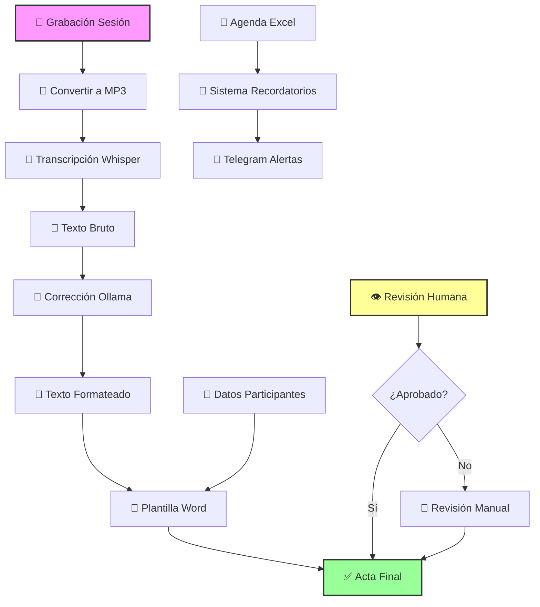
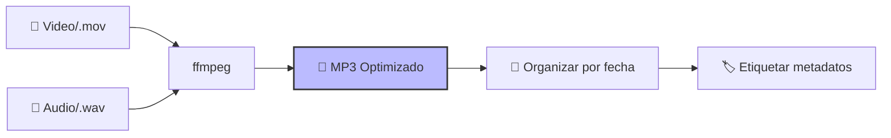
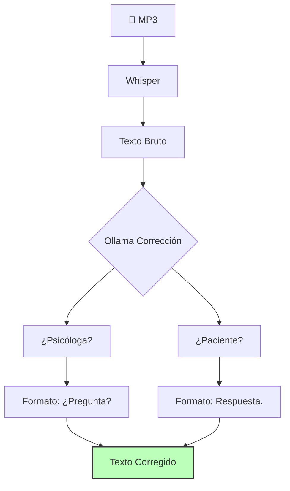
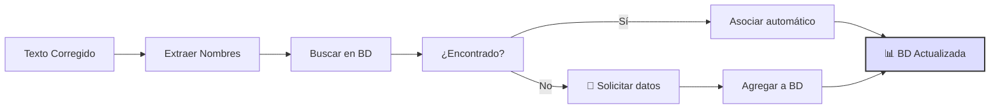
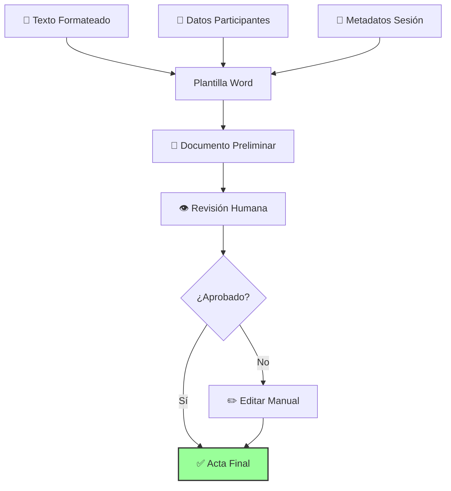
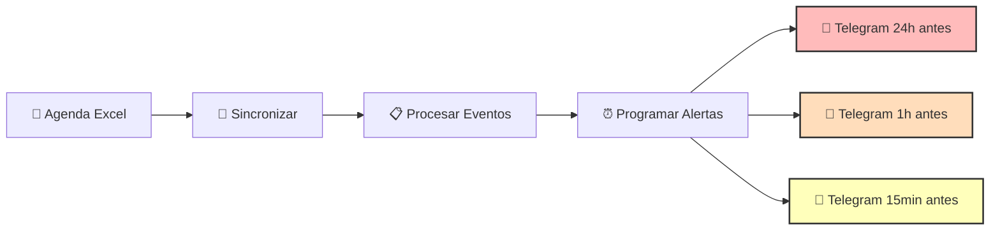

# 🔄 FLUJO DE TRABAJO - Diagramas y Procesos

## 🎯 Visión General del Flujo

Psicobot transforma un proceso manual y repetitivo en un flujo automatizado e inteligente, manteniendo siempre el control humano en puntos críticos.



## 📋 Flujo Actual vs Flujo Psicobot

### **Flujo Actual (Manual)**
```
1. 🎤 Grabación sesión
2. ⏳ Esperar fin sesión
3. 🔄 Convertir a MP3 (manual)
4. 🌐 Subir a ElevenLabs
5. ⏳ Esperar transcripción
6. ✍️ Corrección PALABRA POR PALABRA
7. 📝 Copiar a Word
8. 📋 Formatear manualmente
9. 👥 Insertar datos participantes
10. 📄 Revisar y entregar
```

**Tiempo estimado:** 2-3 horas por sesión  
**Puntos de dolor:** Pasos 5, 6, 7, 8

### **Flujo Psicobot (Automático)**
```
1. 🎤 Grabación sesión
2. ⏳ Esperar fin sesión
3. ▶️ Ejecutar script automático
4. 🤖 Procesamiento local automático
5. 👁️ Revisión rápida (10-15 min)
6. ✅ Aprobar y entregar
```

**Tiempo estimado:** 20-30 minutos por sesión  
**Ahorro:** 70-85% del tiempo

## 🔧 Flujo Técnico Detallado

### **Paso 1: Captura y Preparación**


**Script:** `preparar_audio.sh`
```bash
# Ejemplo de uso:
./preparar_audio.sh sesion_2026-04-19.mov
# Resultado: audios/2026-04-19/sesion.mp3
```

### **Paso 2: Transcripción Inteligente**


**Script:** `transcribir_sesion.sh`
```bash
# Ejemplo:
./transcribir_sesion.sh audios/2026-04-19/sesion.mp3
# Resultado: transcripciones/2026-04-19/sesion_corregida.txt
```

### **Paso 3: Gestión de Datos**


**Script:** `gestionar_participantes.py`
```python
# Ejemplo:
python gestionar_participantes.py --transcripcion sesion_corregida.txt
# Busca participantes, sugiere asociaciones
```

### **Paso 4: Generación de Documentos**


**Script:** `generar_acta.sh`
```bash
# Ejemplo:
./generar_acta.sh \
  --transcripcion sesion_corregida.txt \
  --participante "Ana López" \
  --fecha "2026-04-19" \
  --plantilla "psicologia_sesion.docx"
# Resultado: actas/2026-04-19_ana_lopez.docx
```

### **Paso 5: Sistema de Recordatorios**


**Script:** `sincronizar_agenda.sh`
```bash
# Ejemplo:
./sincronizar_agenda.sh --excel "agenda_juzgado.xlsx"
# Programa recordatorios automáticos
```

## 🎮 Flujo de Uso Diario

### **Escenario: Día de trabajo típico**
```
08:00 📱 Telegram: "Buenos días XeatBoss. Hoy tienes:
        - 10:00: Sesión con Ana López (Virtual)
        - 14:00: Sesión con Carlos Méndez (Presencial)"
        
08:05 💻 Ejecutar: ./preparar_dia.sh
        • Descarga agenda del día
        • Prepara plantillas necesarias
        • Verifica datos participantes
        
10:00 🎤 Sesión con Ana López (grabación automática)
        
10:45 ✅ Fin sesión
        Ejecutar: ./procesar_sesion.sh "ana_lopez_2026-04-19"
        • Convierte audio
        • Transcribe y corrige
        • Genera acta preliminar
        
10:55 👁️ Revisar acta (10 minutos)
        • Verificar formato
        • Confirmar datos
        • Ajustar si necesario
        
11:00 ✅ Acta lista para entrega
        
14:00 🔄 Repetir proceso para Carlos Méndez
        
16:00 📊 Resumen diario automático
        Telegram: "Hoy procesaste 2 sesiones (3.5h audio)
        Tiempo ahorrado estimado: 4 horas"
```

### **Script Principal:** `psicobot_diario.sh`
```bash
#!/bin/bash
# Flujo completo automatizado
echo "🧠 PSICOBOT - Flujo de trabajo diario"
echo "====================================="

# 1. Verificar agenda del día
./sincronizar_agenda.sh

# 2. Para cada sesión programada:
#    - Preparar plantillas
#    - Verificar datos participantes
#    - Esperar grabación
#    - Procesar automáticamente
#    - Generar documento
#    - Esperar aprobación

# 3. Generar resumen diario
./generar_resumen.sh
```

## 🔄 Proceso de Revisión y Aprobación

### **Checklist de Revisión Humana:**
```markdown
- [ ] **Formato diálogo correcto**
  - Psicóloga: ¿Preguntas con signos?
  - Paciente: Oraciones con punto.
  
- [ ] **Términos psicológicos precisos**
  - Verificar terminología especializada
  - Corregir posibles malentendidos
  
- [ ] **Datos participantes correctos**
  - Nombre exacto
  - Tipo (presencial/virtual)
  - Información de contacto actualizada
  
- [ ] **Metadatos completos**
  - Fecha y hora exactas
  - Duración sesión
  - Observaciones relevantes
  
- [ ] **Confidencialidad preservada**
  - Sin datos identificadores innecesarios
  - Formato apropiado para archivo
```

### **Interfaz de Revisión:**
```bash
./revisar_acta.sh actas/2026-04-19_ana_lopez.docx

¿La transcripción es correcta? [S/n]: S
¿Los datos participantes son correctos? [S/n]: S
¿El formato psicológico es apropiado? [S/n]: S
¿Aprobar y finalizar? [S/n]: S

✅ Acta aprobada y archivada.
📊 Tiempo de revisión: 8 minutos.
```

## 📊 Flujo de Datos y Archivos

### **Estructura de Directorios:**
```
psicobot_data/
├── 📁 audios/                  # Grabaciones originales
│   ├── 📁 2026-04-19/
│   │   ├── 🎵 sesion_ana.mp3
│   │   └── 🎵 sesion_carlos.mp3
│   └── 📁 2026-04-20/
│
├── 📁 transcripciones/         # Textos procesados
│   ├── 📁 2026-04-19/
│   │   ├── 📝 sesion_ana_bruta.txt
│   │   ├── 📝 sesion_ana_corregida.txt
│   │   └── 📝 sesion_ana_formateada.txt
│
├── 📁 actas/                   # Documentos finales
│   ├── 📄 2026-04-19_ana_lopez.docx
│   └── 📄 2026-04-19_carlos_mendez.docx
│
├── 📁 database/                # Base de datos
│   ├── 🗃️ participantes.db
│   └── 🗃️ sesiones.db
│
└── 📁 logs/                    # Registros del sistema
    ├── 📄 2026-04-19_procesamiento.log
    └── 📄 2026-04-19_errores.log
```

### **Flujo de Transformación de Archivos:**
```
sesion.mov
    ↓ (ffmpeg)
sesion.mp3
    ↓ (Whisper)
sesion_bruta.txt
    ↓ (Ollama corrección)
sesion_corregida.txt
    ↓ (Formateo automático)
sesion_formateada.txt
    ↓ (Plantilla Word + datos)
acta_final.docx
```

## ⚠️ Puntos de Decisión y Excepciones

### **Decisiones Automáticas vs Humanas:**
| Decisión | Automática | Humana | Razón |
|----------|------------|---------|-------|
| Formato diálogo | ✅ | ❌ | Reglas claras, algoritmo preciso |
| Corrección términos | ⚠️ | ✅ | Contexto psicológico complejo |
| Datos participantes | ⚠️ | ✅ | Precisión crítica, posibles cambios |
| Aprobación final | ❌ | ✅ | Responsabilidad legal/ética |

### **Manejo de Excepciones:**
1. **Audio de baja calidad:**
   - Sistema detecta automáticamente
   - Notifica para grabación alternativa
   - Sugiere soluciones técnicas

2. **Participante nuevo:**
   - Detecta nombre no en base de datos
   - Pausa procesamiento
   - Solicita datos manualmente

3. **Error en transcripción:**
   - Identifica segmentos problemáticos
   - Marca para revisión especial
   - Sugiere correcciones posibles

## 🔄 Ciclo de Mejora Continua

### **Feedback Integrado:**
```
Procesar Sesión → Generar Acta → Revisión Humana → Feedback → Ajustar Sistema
      ↓               ↓              ↓               ↓            ↓
   Métricas       Calidad        Tiempo         Problemas     Mejoras
   capturadas    documentada    registrado     identificados  implementadas
```

### **Métricas Automáticas:**
```bash
# Al final de cada procesamiento:
./registrar_metricas.sh \
  --sesion "ana_lopez_2026-04-19" \
  --tiempo_transcripcion "45min" \
  --tiempo_revision "10min" \
  --calidad_estimada "95%" \
  --problemas_detectados "termino_tecnico_mal"
```

## 🎯 Resumen de Beneficios del Flujo

### **Eficiencia:**
- ⏱️ **Reducción tiempo:** 70-85% por sesión
- 🔄 **Procesamiento paralelo:** Múltiples sesiones simultáneas
- 📊 **Organización automática:** Archivos estructurados

### **Calidad:**
- 🎯 **Consistencia:** Mismo formato siempre
- 🧠 **Precisión:** Corrección contextualizada
- 📋 **Completitud:** Metadatos automáticos

### **Control:**
- 👁️ **Revisión humana** en puntos críticos
- 🔧 **Ajustes manuales** cuando necesario
- 📈 **Feedback integrado** para mejora continua

---
**Diagramas actualizados:** 19 de Abril, 2026  
**Flujo versión:** 1.0.0 (Piloto)  
**Próxima optimización:** Post Fase 1  
**Responsable:** ClawXeatJr