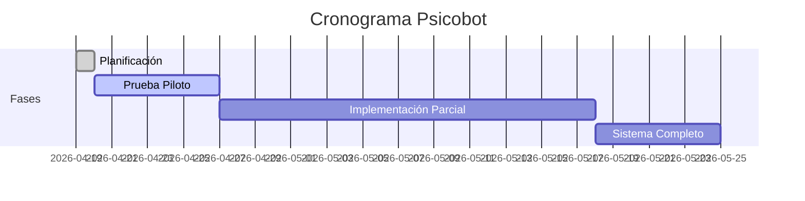

# 🧠 PSICOBOT - Sistema de Transcripción Psicológica

## 🏠 Página Principal - Obsidian Vault

**Última actualización:** 19 Abril 2026  
**Estado del proyecto:** Fase 0 Completada ✅

## 📁 Estructura del Vault

```
Psicobot/
├── 📁 Checklists/          # Listas de verificación diarias
├── 📁 Documentacion/       # Documentación base del proyecto
├── 📁 Logs-Diarios/        # Registros de progreso diario
├── 📁 Recursos/            # Plantillas, scripts, recursos
├── 📁 Sesiones/            # Notas por sesión procesada
└── 📁 Configuracion/       # Configuraciones del sistema
```

## 🔄 Flujo de Trabajo Diario

### **Mañana (20 Abril 2026):**
1. ✅ **Revisar** [[2026-04-20_Fase1-Piloto]]
2. ✅ **Completar** checklist instalación
3. ✅ **Ejecutar** primera prueba piloto
4. ✅ **Documentar** resultados en [[2026-04-20-Log]]

### **Siguientes días:**
- [[2026-04-21]] - Instalación Whisper + pruebas
- [[2026-04-22]] - Scripts demo funcionando
- [[2026-04-23]] - Feedback y ajustes

## 🎯 Metas del Proyecto

### **Objetivo Principal:**
Reducir tiempo de transcripción psicológica en **70-80%** manteniendo privacidad 100% local.

### **Fases:**
1. [[Fase-0-Planificacion]] ✅ **COMPLETADA**
2. [[Fase-1-Prueba-Piloto]] 🟡 **EN PROGRESO** (20-26 Abril)
3. [[Fase-2-Implementacion-Parcial]] ⏳ (27 Abril - 17 Mayo)
4. [[Fase-3-Sistema-Completo]] ⏳ (18-24 Mayo)

## 👥 Colaboración

### **XeatBoss (Usuario/Cliente):**
- Verificación checklists diarios
- Pruebas funcionales
- Feedback continuo
- Control final sobre automatizaciones

### **ClawXeatJr (Soporte Técnico):**
- Desarrollo scripts y herramientas
- Guías de instalación/configuración
- Solución de problemas técnicos
- Mejoras basadas en feedback

## 🔗 Enlaces Rápidos

### **Documentación Base:**
- [[README]] - Visión del proyecto
- [[PLAN]] - Plan de 6 semanas
- [[FLUJO_TRABAJO]] - Diagramas y procesos
- [[ESTRUCTURA]] - Organización de archivos
- [[REQUISITOS]] - Especificaciones técnicas

### **Plantillas:**
- [[Plantilla-Checklist]] - Para nuevas listas
- [[Plantilla-Log-Diario]] - Para registros diarios
- [[Plantilla-Sesion]] - Para sesiones procesadas

### **Checklists Activos:**
- [[2026-04-20_Fase1-Piloto]] - Checklist para mañana

## 📊 Progreso General



## 🚨 Notas Importantes

### **Seguridad:**
- 🔒 **Todo procesamiento 100% local**
- 🔐 **Ningún dato sensible sale del PC**
- 📋 **Revisión humana obligatoria** en transcripciones
- 🗑️ **Tokens GitHub temporales** (revocar después de usar)

### **Próximos Pasos:**
1. Completar [[2026-04-20_Fase1-Piloto]] mañana
2. Instalar Whisper y dependencias
3. Probar con audio de ejemplo
4. Documentar resultados

---
**Esta página se actualizará automáticamente** conforme avance el proyecto.
Para editar, modifica este archivo o usa las plantillas proporcionadas.